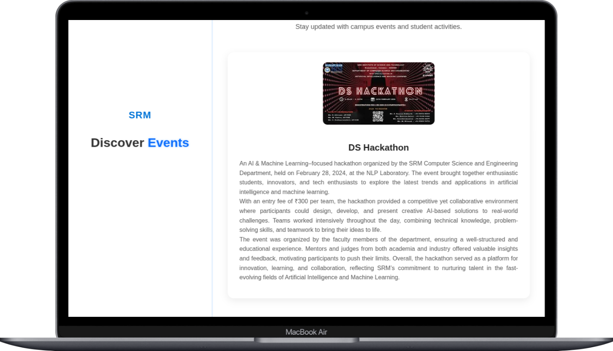
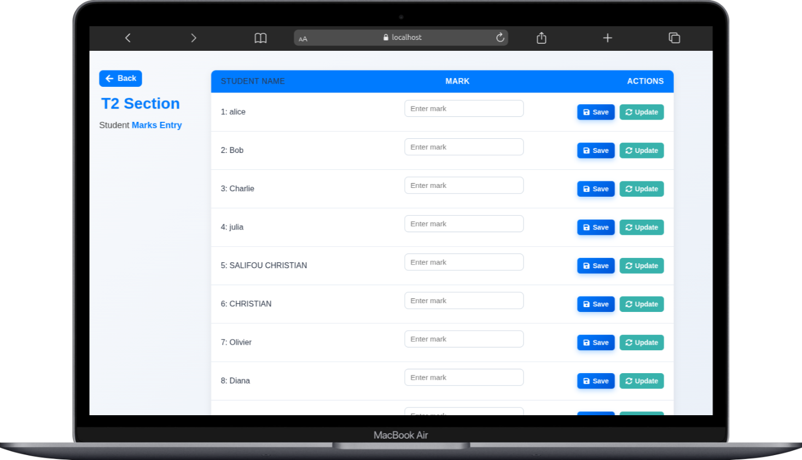

<h1 align="center" id="title">Student Management</h1>

<p align="center"></p>

<p id="description">The Student Management System (SMS) was developed to handle student data efficiently. Traditional methods of managing attendance marks and communication often involve manual entry making them error-prone and time-consuming. This project leverages modern technologies to offer a unified responsive platform that simplifies the management of educational records.</p>

<h2>🚀 Demo</h2>

[https://student-managment-one.vercel.app/](https://student-managment-one.vercel.app/)

<h2>Project Screenshots:</h2>






<h2>🛠️ Installation Steps:</h2>

<p>1. Clone the repository</p>

<p>2. Install necessary dependencies</p>

```
npm install
```

<p>3. Run the project</p>

```
npm run dev
```

  
  
<h2>💻 Built with</h2>

Technologies used in the project:

*   React
*   spring-Boot
*   Mysql
*   xampp